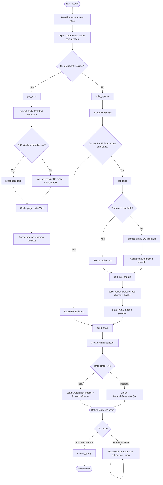
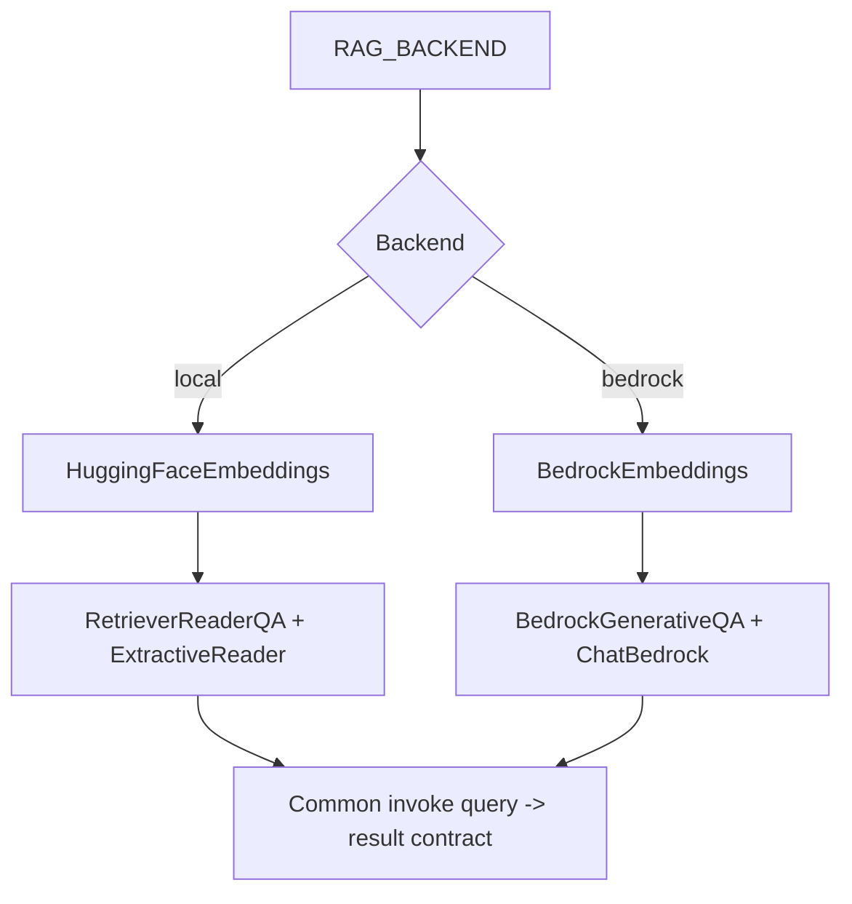
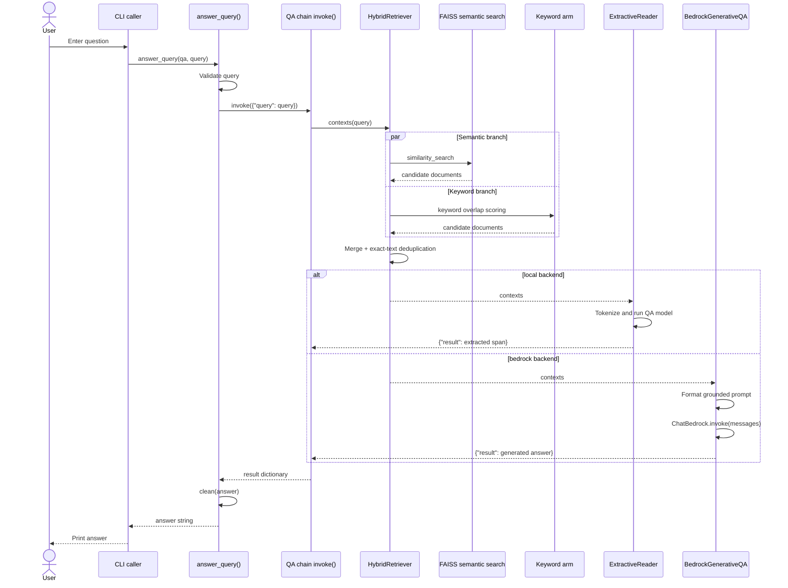
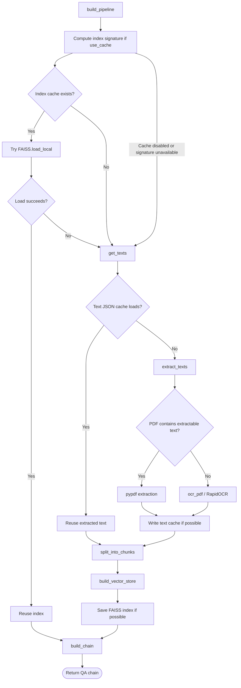
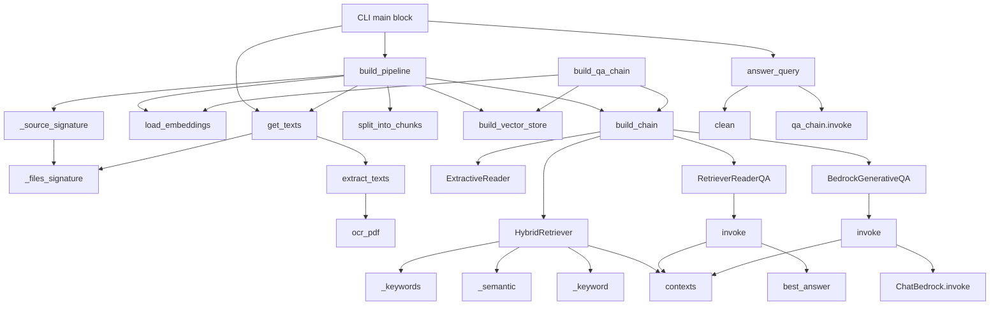

# End-to-End RAG Pipeline: Function-Wise and Method-Wise Flow

> Based on the supplied `rag_pipeline.py` source. This documents the functions, methods, backend branches, cache paths, and CLI behavior visible in that source. The implementation of `app.py` was not supplied, so web-route behavior is intentionally not inferred.

## 1. End-to-end overview



## 2. Module initialization and configuration

These happen when the module starts:

1. Set `HF_HUB_OFFLINE=1` and `TRANSFORMERS_OFFLINE=1` before importing Transformers; disable Gradio analytics and reduce Transformers logging.
2. Import PDF, OCR/image, LangChain, FAISS, embedding, and QA model dependencies.
3. Read `RAG_PDF_PATHS` into `DEFAULT_PDF_PATHS`; default: `gk_ques_ans.pdf`.
4. Set the local embedding model to `distilbert-base-uncased`.
5. Set `QA_MODEL` from `RAG_QA_MODEL`, defaulting to `deepset/roberta-base-squad2`.
6. Select `RAG_BACKEND` (`local` by default, or `bedrock`).
7. Configure Bedrock region/model IDs from environment variables.
8. Configure `SEMANTIC_K` and `KEYWORD_K` (both default to 5), stopwords, and `CACHE_DIR` (default `.rag_cache`).

### Backend selection



The source shares PDF/OCR extraction, chunking, hybrid retrieval, and caching between backends. Embeddings and the answerer differ.

## 3. Function-wise and method-wise reference

### `_effective_embedding_id()`
**Purpose:** Identify the embedding model for cache separation.
- If backend is Bedrock, returns `bedrock:<BEDROCK_EMBED_MODEL>`.
- Otherwise returns `EMBEDDING_MODEL`.
- Called by `_source_signature()`.

### `ocr_pdf(path, dpi=200, log=print)`
**Purpose:** OCR a PDF with no extractable embedded text.
1. Lazily import `RapidOCR`, open PDF with PyMuPDF.
2. Render each page at the requested DPI.
3. Convert pixel bytes into a NumPy array and run OCR.
4. Join recognized lines, collect non-empty page text, log page progress.
5. Return page text strings.
**Caller:** `extract_texts()`.

### `extract_texts(pdf_paths, log=print)`
**Purpose:** Extract text using a text-first, OCR-fallback strategy.
1. Iterate through PDF paths and use `PdfReader`.
2. Call `extract_text()` on each page; discard blank pages.
3. If that PDF yields any text, append those extracted pages.
4. Otherwise call `ocr_pdf()` for that PDF.
5. Log total pages; raise `RuntimeError` if no text was recovered.
6. Return page strings.
**Source-specific detail:** The OCR fallback is per PDF file, not per page. If at least one page in a PDF yields text, the implementation does not OCR the other pages in that same PDF.

### `split_into_chunks(pdf_texts, chunk_size=1000, chunk_overlap=200, log=print)`
**Purpose:** Convert page strings to overlapping LangChain `Document` chunks.
1. Wrap each page in `Document(page_content=...)`.
2. Configure `RecursiveCharacterTextSplitter` with `chunk_size`, `chunk_overlap`, and `len`.
3. Split documents, log counts, return chunks.

### `load_embeddings()`
**Purpose:** Load the embedding implementation for the active backend.
- `bedrock`: lazily import and return `BedrockEmbeddings(model_id=..., region_name=...)`.
- `local`: return `HuggingFaceEmbeddings(model_name=EMBEDDING_MODEL)`.

### `build_vector_store(documents, embedding_model, log=print)`
**Purpose:** Build the FAISS vector index.
1. Call `FAISS.from_documents(documents, embedding_model)`.
2. Log vector count and return the vector store.

### `_keywords(text)`
**Purpose:** Produce a set of useful keyword tokens.
1. Lowercase text and extract `[a-z0-9]+` tokens.
2. Remove one-character tokens and words in `_STOPWORDS`.
3. Return a set.
**Callers:** `HybridRetriever.__init__()` and `HybridRetriever._keyword()`.

### `ExtractiveReader.__init__(model, tokenizer, torch_device, max_answer_len=40)`
Stores the QA model, tokenizer, device (`cpu` or `cuda`), and maximum answer span length.

#### `ExtractiveReader.best_answer(question, contexts)`
**Purpose:** Select the best answer span across retrieved contexts in one batch.
1. If no contexts, return `{"answer": "", "score": 0.0}`.
2. Tokenize question/context pairs, truncating only contexts and limiting to 512 tokens.
3. Run the model under `torch.no_grad()` on the configured device.
4. Read start and end logits.
5. Mask non-context tokens, choose the best start, then choose an end within `max_answer_len`.
6. Score the span using start + end logits; retain the best across contexts.
7. Decode and return `{"answer": answer, "score": score}`.
**Caller:** `RetrieverReaderQA.invoke()`.

### `HybridRetriever.__init__(vector_store, all_docs)`
Stores FAISS and all chunks, then precomputes keyword sets for each chunk.

#### `HybridRetriever._semantic(query)`
Calls `vector_store.similarity_search(query, k=SEMANTIC_K)`.

#### `HybridRetriever._keyword(query)`
1. Convert query to keywords; return `[]` if none remain.
2. Score each chunk by query/document keyword overlap.
3. Sort by score and return up to `KEYWORD_K` positive-score chunks.

#### `HybridRetriever.contexts(query)`
1. Get semantic results, then keyword results.
2. Combine in that order.
3. Deduplicate by exact `page_content`, preserving first occurrence.
4. Return context strings.

### `RetrieverReaderQA.__init__(retriever, reader, log=print)`
Stores the hybrid retriever, extractive reader, and logger.

#### `RetrieverReaderQA.invoke(inputs)`
1. Read `inputs["query"]`.
2. Retrieve contexts with `retriever.contexts(query)`.
3. Call `reader.best_answer(query, contexts)`.
4. Strip the answer and return `{"result": answer}`.

### `BedrockGenerativeQA.__init__(retriever, log=print)`
Lazily imports `ChatBedrock`, stores the retriever/logger, and configures the Bedrock chat model with the chosen model ID, region, temperature `0`, and `max_tokens=512`.

#### `BedrockGenerativeQA.invoke(inputs)`
1. Read query and retrieve contexts.
2. If no contexts, return `{"result": "I could not find the answer in the document."}`.
3. Format contexts as numbered passages.
4. Build system/human messages; the system prompt instructs the model to answer only from supplied passages.
5. Invoke Bedrock, strip response content, and return `{"result": answer}`.

### `build_chain(vector_store, log=print)`
**Purpose:** Attach hybrid retrieval to the backend-specific answerer.
1. Read all chunk documents from `vector_store.docstore._dict.values()`.
2. Create `HybridRetriever`.
3. For Bedrock, create and return `BedrockGenerativeQA`.
4. For local backend, set PyTorch thread count best-effort and choose CUDA if available, otherwise CPU.
5. Load `QA_MODEL` tokenizer and model, move model to device, set evaluation mode.
6. Create `ExtractiveReader`, wrap it in `RetrieverReaderQA`, and return it.

### `build_qa_chain(documents, log=print)`
Convenience path without the orchestration of the on-disk FAISS cache:
1. `load_embeddings()`
2. `build_vector_store(...)`
3. `build_chain(...)`
4. Return the QA chain.

### `clean(text)`
1. Strip whitespace (and treat falsey input as empty).
2. For Bedrock, return the full text.
3. For local backend, return only the first paragraph.

### `answer_query(qa_chain, query)`
**Purpose:** Validate and run one query.
1. Empty/whitespace query → `"Please enter a valid query."`
2. Invoke `qa_chain.invoke({"query": query})`.
3. Read `"result"` and pass it to `clean()`.
4. Empty cleaned answer → `"No answer found."`
5. Any exception → return `"Error processing the query: <exception>"`.

### `_files_signature(pdf_paths)`
Hashes the bytes of each source PDF using SHA-1, separating files with a null byte. Returns the first 16 hex characters, or `None` if a file cannot be read.

### `_source_signature(pdf_paths)`
1. Call `_files_signature()`.
2. If unavailable, return `None`.
3. Combine source signature, `_effective_embedding_id()`, and fixed chunk settings `1000/200`.
4. Hash the combined string and return 16 hex characters.
**Purpose:** Make the FAISS cache specific to the source PDFs and index-affecting configuration.

### `get_texts(pdf_paths, log=print)`
**Purpose:** Load extracted text from JSON cache or perform extraction.
1. Calculate `_files_signature()` and locate `text_<signature>.json` under `CACHE_DIR`.
2. If cache exists and parses, return it.
3. If cache read fails or misses, call `extract_texts()`.
4. Attempt to save the text as JSON; cache write errors are non-fatal.
5. Return page strings.

### `build_pipeline(pdf_paths=None, log=print, use_cache=True)`
**Purpose:** Return a ready-to-query QA chain with cache reuse.
1. Use `DEFAULT_PDF_PATHS` if no paths were passed.
2. Load embeddings and compute the FAISS cache signature when caching is enabled.
3. If the matching index directory exists, attempt `FAISS.load_local()`.
4. On successful load, skip extraction, chunking, and embedding.
5. On a miss/load failure: call `get_texts()`, `split_into_chunks()`, then `build_vector_store()`.
6. Save the index when possible; saving failure is non-fatal.
7. Call `build_chain()` and return the chain.

**Two separate caches**
- Text cache key: source PDF bytes. It can be reused if embedding/chunk settings change.
- FAISS cache key: source PDF bytes + effective embedding model + chunk settings.
- Rebuilding the index does not necessarily repeat OCR because `get_texts()` has its own cache.

## 4. One-question execution flow



## 5. Cache decision flow



## 6. Call graph: function and method relationships



## 7. CLI entry-point flow

```mermaid
flowchart TD
    A[python rag_pipeline.py ...] --> B{Argument is extract?}
    B -- Yes --> C[get_texts(DEFAULT_PDF_PATHS)]
    C --> D[Populate text cache and print summary]
    D --> E([Exit])
    B -- No --> F[qa = build_pipeline()]
    F --> G{Question arguments supplied?}
    G -- Yes --> H[Join args into one question]
    H --> I[answer_query(qa, question)]
    I --> J[Print answer and exit]
    G -- No --> K[Start interactive REPL]
    K --> L[Read input]
    L --> M{Blank input, Ctrl-C, or EOF?}
    M -- Yes --> N[Print Bye and exit]
    M -- No --> O[answer_query(qa, question)]
    O --> P[Print answer]
    P --> L
```

```bash
# Extract text / OCR and populate the text cache
python rag_pipeline.py extract

# Ask one question
python rag_pipeline.py "What is photosynthesis?"

# Interactive question-answer loop
python rag_pipeline.py
```

The `extract` mode calls `get_texts()` and exits before embeddings or FAISS are built.

## 8. Data contracts between stages

| Function / method | Input | Output |
|---|---|---|
| `extract_texts()` / `ocr_pdf()` | PDF paths | Page-text strings |
| `split_into_chunks()` | Page-text strings | LangChain `Document` chunks |
| `load_embeddings()` | Backend configuration | Embedding object |
| `build_vector_store()` | Documents + embedding object | FAISS vector store |
| `HybridRetriever.contexts()` | Query string | Ordered context strings |
| `ExtractiveReader.best_answer()` | Question + contexts | `{"answer": ..., "score": ...}` |
| `RetrieverReaderQA.invoke()` | `{"query": ...}` | `{"result": ...}` |
| `BedrockGenerativeQA.invoke()` | `{"query": ...}` | `{"result": ...}` |
| `answer_query()` | QA chain + query | Clean answer / fallback / error string |
| `build_pipeline()` | Optional PDF paths | Ready-to-query QA chain |

## 9. Source-specific notes and caveats

- The local path expects cached Hugging Face models because offline mode is enabled.
- Bedrock-specific imports are lazy, so the local path does not require those imports at initialization.
- The semantic and keyword retrieval arms are merged, semantic first, then deduplicated by exact text.
- The local backend extracts an answer span; the Bedrock backend generates a grounded response from retrieved passages.
- `answer_query()` catches exceptions and returns an error string rather than raising the exception.
- `build_pipeline()` loads the embedding object before checking whether a cached FAISS index can be reused.
- `FAISS.load_local(..., allow_dangerous_deserialization=True)` is only appropriate for a trusted local cache; do not load untrusted index/cache files with this option.
- `_source_signature()` hardcodes chunk settings as `1000/200`, matching current defaults in `split_into_chunks()`.
- Although the source comments mention `app.py`, its contents were not provided, so web endpoints and server request handling are outside this flow document.
