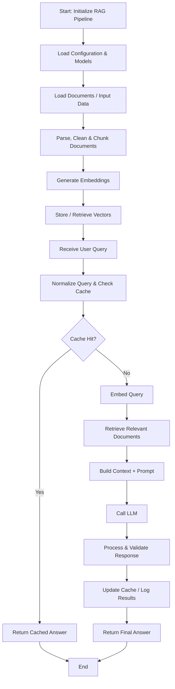

## RAG Pipeline — End-to-End Flow

### Flow in simple steps

1. Initialize — Load configuration, embedding model, LLM, and vector store.
2. Ingest documents — Load, clean, and split source documents into chunks.
3. Create embeddings — Convert document chunks into vector representations and store them.
4. Accept query — Receive the user's question and normalize it.
5. Check cache — Return a cached answer if a valid match exists.
6. Retrieve context — Embed the query and search for relevant document chunks.
7. Build prompt — Combine the question with retrieved context.
8. Generate answer — Send the prompt to the LLM.
9. Process response — Apply the pipeline's response handling and validation.
10. Cache and return — Record results as configured and return the answer.

Core flow: `Documents → Chunks → Embeddings → Vector Store → User Query → Retrieval → Context + Prompt → LLM → Answer`

Interview : 

    In my RAG pipeline, the process starts by loading the configuration, embedding model, LLM, and vector store. First, documents are loaded, cleaned, and split into smaller chunks. These chunks are converted into embeddings and stored in the vector database.

    When a user submits a query, the pipeline checks the cache first. If there’s no cache hit, it converts the query into an embedding and retrieves the most relevant document chunks. The retrieved context is combined with the user’s question to create a prompt, which is sent to the LLM to generate an answer. Finally, the response is processed, cached if configured, and returned to the user.

Technical Interview :

Based on your actual `rag_pipeline.py` source, here are the technical details you can mention in an interview. Your pipeline supports two backends: local/offline and AWS Bedrock.

## 1. Models, parsers, and technologies used

| Component               | Technology / model                                               | Purpose                                                                 |
| ----------------------- | ---------------------------------------------------------------- | ----------------------------------------------------------------------- |
| PDF text extraction     | `pypdf.PdfReader`                                                | Extracts text from normal PDFs                                          |
| PDF rendering           | PyMuPDF (`pymupdf`)                                              | Renders scanned PDF pages into images for OCR                           |
| OCR                     | `RapidOCR` from `rapidocr_onnxruntime`                           | Extracts text from scanned PDFs                                         |
| Chunking                | LangChain `RecursiveCharacterTextSplitter`                       | Splits text into chunks of 1,000 characters, with 200-character overlap |
| Local embeddings        | `distilbert-base-uncased`                                        | Configured Hugging Face embedding model                                 |
| Cloud embeddings        | Amazon Titan Text Embeddings V2 (`amazon.titan-embed-text-v2:0`) | Creates embeddings when using Bedrock                                   |
| Vector store            | FAISS                                                            | Stores vectors and performs similarity search                           |
| Local QA reader         | `deepset/roberta-base-squad2`                                    | Extracts an answer span from retrieved context                          |
| Cloud answer generation | Anthropic Claude 3 Haiku via Amazon Bedrock                      | Generates context-grounded answers in the cloud backend                 |
| Framework               | LangChain + Hugging Face Transformers                            | Connects document processing, retrieval, and QA                         |

The source also implements hybrid retrieval: it combines semantic search with keyword-based retrieval. It caches extracted text and the FAISS index to reduce repeated OCR and embedding work.&#x20;

Pasted markdown.md

Pasted markdown.md

## 2. Interview-ready technical explanation

My RAG pipeline uses `pypdf` for extracting text from PDFs, with PyMuPDF and RapidOCR as a fallback for scanned documents. I split the extracted text using LangChain’s `RecursiveCharacterTextSplitter`, with a chunk size of 1,000 characters and an overlap of 200 characters.

For local execution, the code configures Hugging Face embeddings and FAISS for vector storage and retrieval. It uses `deepset/roberta-base-squad2` as an extractive question-answering model, which identifies the answer span in the retrieved context. For cloud deployment, the pipeline supports Amazon Titan embeddings and Claude 3 Haiku through AWS Bedrock.

I also implemented hybrid retrieval and disk caching so the system can combine semantic and keyword-based matching while avoiding unnecessary document processing and index rebuilding.”

Important: The exact local embedding model configured in the code is `distilbert-base-uncased`. Be prepared to explain its role and verify that it is suitable for the embedding wrapper in your installed environment. Also, distinguish the local extractive QA reader from the cloud generative LLM—your code uses different approaches depending on the backend.